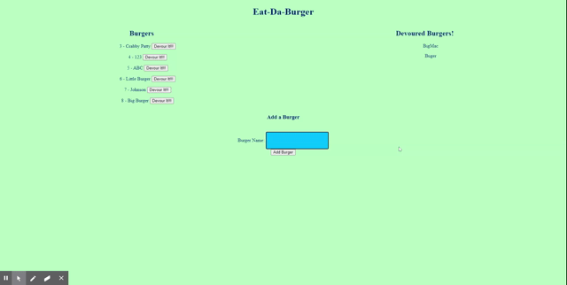

# Burger-Management
Burger Management using Node Express Handlebars

## Description
This app allows users to create and devour burgers.  The user creates burgers by entering the name of a burger and clicking the create button.  The burger then loads into a column of burgers available to devour.  Upon clicking the devour button, the burger moves to a seperate column to show it has been eatten.

## Table of Contents

* [Demo](#demo)
* [License](#license)
* [Contact](#contact)

## Demo

## License 

This application is licensed under the MIT License. 

## Technologies

* Node.js 
* Express.js 
* MySQL
* Heroku

## Contact
* GitHub - lundyc0917
* Email - lundyc0917@gmail.com
